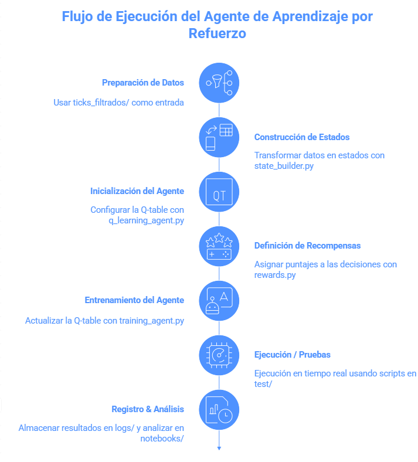

Agente de Aprendizaje por Refuerzo para Optimización de Camiones Mineros
## 1. Descripción General
Este proyecto implementa un agente de aprendizaje por refuerzo (Q-Learning) para optimizar la asignación y despacho de camiones en un entorno minero simulado. El objetivo es reducir tiempos de espera, balancear la carga entre palas, minimizar colas y optimizar el consumo de combustible, utilizando datos reales o sintéticos del proceso minero.
---

El objetivo principal es:  
- Reducir tiempos de espera  
- Balancear la carga entre palas  
- Minimizar colas   

Se utilizan **datos reales o sintéticos** del proceso minero como entrada.  

---

## 2. Estructura del Proyecto  

```bash
RL_Agente_Mineria/
│── agent/                  # Lógica principal del agente RL
│   ├── q_learning_agent.py # Implementación del Q-Learning
│   ├── state_builder.py    # Construcción y discretización de estados
│   ├── rewards.py          # Función de recompensa
│   └── training_agent.py   # Script de entrenamiento
│
│── logs/                   # Carpeta de registros
│   ├── decisiones_guardadas/ # Decisiones tomadas por el agente
│   └── logs_ticks/         # Logs relacionados con los ticks procesados
│
│── notebooks/              # Análisis y visualización (Jupyter)
│
│── test/                   # Scripts de prueba y validación
│   ├── Ejecucion_Agente_RealTime.py
│   └── Extraer_ticks_Individuales.py
│
│── ticks_filtrados/        # Datos JSON con ticks filtrados
│── utils/                  # Funciones auxiliares
│── config.yaml             # Configuración de parámetros
│── MINE-hudbay-ALGO-2025-08-15.json # Datos de entorno
│── README.md               # Documentación principal
│── __init__.py             # Inicialización de paquetes Python

```

## 3. Descripción de Componentes
📁 agent/

q_learning_agent.py → Clase QLearningAgent que maneja la selección de acciones y actualización de la Q-table.

state_builder.py → Convierte datos de ticks en estados discretos procesables.

rewards.py → Implementa la función de recompensa, premiando y penalizando según contexto.

training_agent.py → Orquesta el ciclo de entrenamiento, gestión de episodios y persistencia de la Q-table.

📁 logs/

decisiones_guardadas/ → Decisiones pendientes para el próximo tick.

logs_ticks/ → Información detallada de cada tick procesado.

📁 notebooks/

Exploración de datos, análisis de rendimiento y visualización de métricas.

📁 test/

Ejecucion_Agente_RealTime.py → Ejecuta el agente en un entorno simulado o real.

Extraer_ticks_Individuales.py → Analiza ticks específicos de forma independiente.

📁 ticks_filtrados/

Archivos JSON con datos de ticks ya filtrados como entrada.

📁 utils/

Funciones auxiliares de soporte para distintos scripts.


## 4. Flujo de Ejecución

```mermaid
flowchart TB
    A[Preparación de datos<br/>] : Se utilizan archivos JSON de ticks_filtrados como entrada.
                        ↓
    B[Construcción de estados<br/> state_builder.py] : state_builder.py transforma los datos en estados discretos.
                        ↓
    C[Inicialización del agente<br/> q_learning_agent.py] : q_learning_agent.py configura el agente y su Q-table.
                        ↓
    D[Definición de recompensas<br/> rewards.py] : rewards.py calcula la recompensa para cada acción tomada.
                        ↓
    E[Entrenamiento<br/> training_agent.py] : training_agent.py ejecuta el ciclo de aprendizaje, actualizando la Q-table.
                        ↓
    F[Ejecución / Pruebas<br/> test/] : Scripts en test permiten ejecutar el agente en tiempo real o analizar resultados.
                        ↓
    G[Logging & análisis<br/> logs/ + notebooks/] : Los resultados y decisiones se almacenan en logs y pueden analizarse con notebooks.
```




## 5. Instalación y Uso
1️⃣ Instala las dependencias necesarias (si las hay, por ejemplo, numpy, pandas, etc.).

2️⃣ Entrenamiento del agente
python agent/training_agent.py

3️⃣ Ejecución en tiempo real
python test/Ejecucion_Agente_RealTime.py

## 6. Personalización

-- Parámetros de aprendizaje (alpha, gamma, epsilon) → modificar en q_learning_agent.py.

-- Función de recompensa → ajustar en rewards.py según objetivos del entorno.

-- Discretización de estados → cambiar en state_builder.py para probar representaciones distintas.

## 7. Resultados y Métricas

Los logs almacenan:

-- Recompensa total

-- Número de estados únicos descubiertos

-- Tasa exploración/explotación

-- Distribución de acciones

